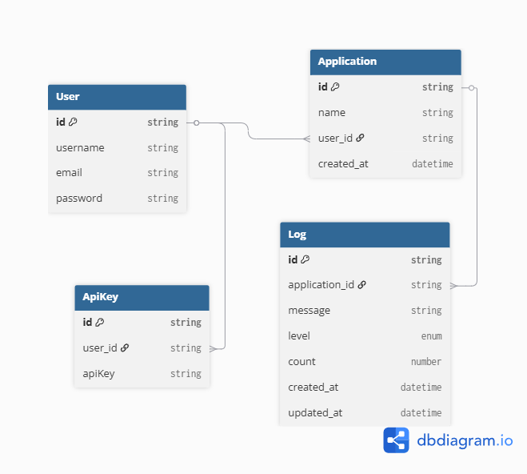

# Dashboard Logs Manager

A full-stack logging dashboard project with a React + TypeScript frontend and an Express + MongoDB backend.

## Live Frontend

The frontend is deployed and available at:

https://tubular-zabaione-6d8c05.netlify.app/

## Overview

This repository contains two main applications:

- `app/` — React + Vite frontend for user authentication, application management, and log viewing.
- `backend/` — Express API server with MongoDB persistence for users, API keys, applications, and logs.

### Key features

- User registration and login
- API-key based authentication for protected backend routes
- Create and manage applications
- Store and query logs by application, message, level, and date
- Pagination and sorting support for logs

## Architecture

The backend uses the following entities:

- `User`
- `ApiKey`
- `Application`
- `Log`

The entity relationship diagram is available here:



## Backend Local Setup

### Prerequisites

- Node.js 24.x (Node 24.16 recommended)
- npm
- A running MongoDB instance

### Install and run the backend

1. Open a terminal and navigate to the backend folder:

   ```bash
   cd backend
   ```

2. Install dependencies:

   ```bash
   npm install
   ```

3. Create a `.env` file in `backend/` with the following values:

   ```env
   PORT=3003
   BASE_URL=http://localhost:3003
   DB_URL=mongodb://127.0.0.1:27017
   DB_NAME=dashboard
   JWT_SECRET=your_jwt_secret_here
   SALT_ROUNDS=10
   ```

4. Start the backend server:

   ```bash
   npm run start
   ```

   This command compiles the TypeScript sources and starts the server from `dist/server.js`.

### Verify the backend

Once running, you can verify the server with:

```bash
curl http://localhost:3003/ping
```

A successful response should return:

```json
{ "message": "pong" }
```

## Backend API Summary

### Authentication

- `POST /api/users/register`
  - Register a new user
  - Returns `user` and `apiKey`

- `POST /api/users/login`
  - Login with email and password
  - Returns `user` and `apiKey`

- `POST /api/users/logout`
  - Revoke API keys for the authenticated user
  - Requires `Authorization: Bearer <apiKey>`

### Applications

- `GET /api/applications`
  - Get all applications for the authenticated user
  - Requires authentication

- `POST /api/applications`
  - Create a new application
  - Requires authentication

- `GET /api/applications/:name`
  - Get an application by name
  - Requires authentication

- `DELETE /api/applications/:name`
  - Delete an application by name
  - Requires authentication

### Logs

- `GET /api/applications/:name/logs`
  - Retrieve logs for an application
  - Supports optional query filters: `sortingAlgo`, `message`, `level`, `limit`, `offset`
  - Requires authentication

- `POST /api/applications/:name/logs`
  - Add a log entry to an application
  - Requires authentication

## Authentication Notes

This project uses API-key authentication. After login or registration, the backend returns an `apiKey`.

Include that key in all protected requests as:

```http
Authorization: Bearer <apiKey>
```

## Frontend

The frontend lives in the `app/` folder and is deployed at the live URL above. It communicates with the backend API and provides UI for:

- registering and logging in
- creating and deleting applications
- viewing application logs
- searching and filtering logs

## Folder structure

- `app/` — frontend application
- `backend/` — backend API server
- `backend/diagrams/erd.png` — entity relationship diagram

## Notes

- The backend server accepts requests from the live frontend origin as well as `http://localhost:5173`.
- The backend project is written in TypeScript and compiled before running.
- For local development, ensure your MongoDB instance is available and the `.env` values match your environment.
